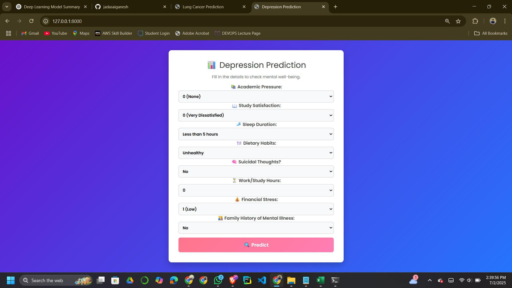
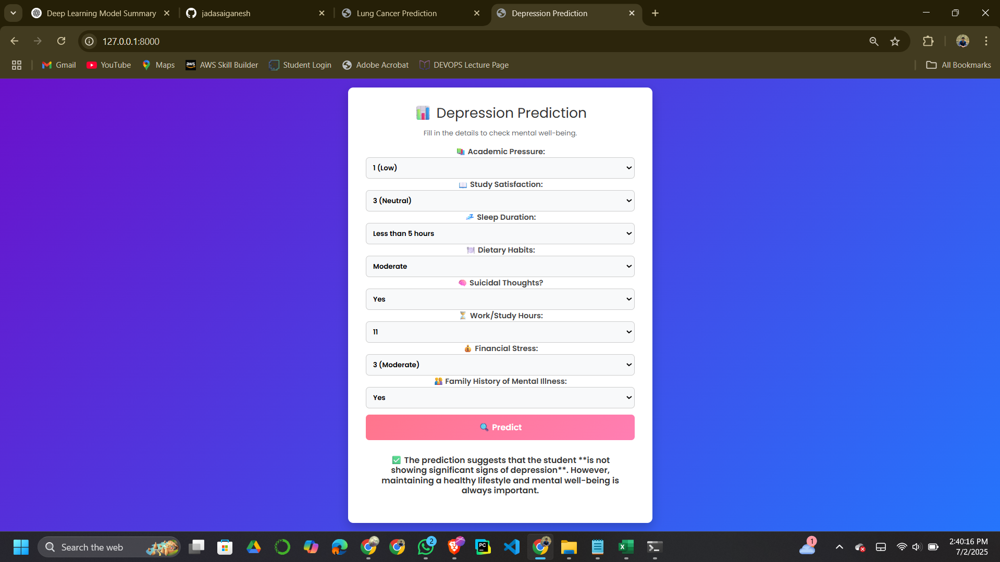
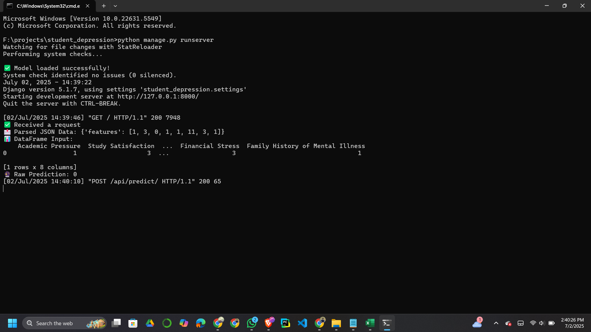

# 🎓 Student Depression Prediction

A machine learning-powered web application that analyzes student lifestyle and emotional indicators to predict the likelihood of depression.  
This project is built to support **student mental well-being** and provide early alerts based on behavioral patterns.

---

## 🧠 Project Motivation

Student mental health is a growing concern globally.  
The aim of this application is to help students identify early signs of depression and encourage positive mental health habits by leveraging AI.

---

## 🚀 Features

- 📊 **Predictive Modeling** using XGBoost classifier
- 💻 Web interface for entering academic and lifestyle details
- ✅ Output: Whether the student shows potential signs of depression
- 📈 Provides insights based on:
  - Study habits
  - Sleep patterns
  - Suicidal thoughts
  - Diet
  - Workload
  - Family mental health history

---

## 🧠 Model Info

- **Algorithm**: XGBoost Classifier
- **Trained on**: Pre-processed dataset of student well-being metrics
- **Model Path**:
  ```python
  MODEL_PATH = r"F:\projects\student_depression\predictor\models\tuned_xgb_model.pkl"
  ```
> ⚠️ **Note:**  
> If you're cloning this repository, update the model path in your code to match your local system.  
> For example, instead of:
> ```python
> MODEL_PATH = r"F:\projects\student_depression\predictor\models\tuned_xgb_model.pkl"
> ```
> use a relative path like:
> ```python
> MODEL_PATH = 'predictor/models/tuned_xgb_model.pkl'
> ```

## 📋 Sample Prediction

### 📊 Input

- 📚 **Academic Pressure**: 1 (Low)  
- 📖 **Study Satisfaction**: 3 (Neutral)  
- 💤 **Sleep Duration**: Less than 5 hours  
- 🍽️ **Dietary Habits**: Moderate  
- 🧠 **Suicidal Thoughts**: Yes  
- ⏳ **Work/Study Hours**: 11  
- 💰 **Financial Stress**: 3 (Moderate)  
- 👨‍👩‍👧 **Family History of Mental Illness**: Yes  

---

### ✅ Output

> The prediction suggests that the student **is not showing significant signs of depression**.  
> Maintaining a healthy lifestyle and mental well-being is always important.
---


## 🛠️ How to Run Locally
### 1️⃣ Clone the Repository
```bash

git clone https://github.com/jadasaiganesh/Student_Depression_Prediction.git
cd Student_Depression_Prediction
```

### 2️⃣ Create and Activate Virtual Environment
```bash
python -m venv venv
venv\Scripts\activate      # Windows
# or
source venv/bin/activate   # macOS/Linux
```
### 3️⃣ Install Requirements
```bash

pip install -r requirements.txt
```
### 4️⃣ Run the Django Server
```bash

python manage.py runserver
Visit 👉 http://127.0.0.1:8000/ to use the application.
```
---
## 📁 Project Structure

```bash
Student_Depression_Prediction/
│
├── .gitignore
├── db.sqlite3
├── manage.py
├── structure.txt
├── student prediction.ipynb
├── student_depression_dataset.csv
│
├── images/
│   ├── 1.png
│   ├── 2.png
│   └── 3.png
│
├── prediction/
│   ├── admin.py
│   ├── apps.py
│   ├── models.py
│   ├── tests.py
│   ├── urls.py
│   ├── views.py
│   ├── __init__.py
│   │
│   ├── migrations/
│   │   ├── 0001_initial.py
│   │   └── __init__.py
│   │
│   ├── models/
│   │   ├── student_depression_xgb_model.pkl
│   │   └── student_depression_xgb_model.json
│   │
│   ├── static/
│   ├── templates/
│   │   └── predict.html
│
├── student_depression/
│   ├── asgi.py
│   ├── settings.py
│   ├── urls.py
│   ├── wsgi.py
│   └── __init__.py
```
---
## 💡 Technologies Used

- 🐍 **Python**
- ⚙️ **Django** (Web Framework)
- 📦 **XGBoost** (Machine Learning)
- 🧪 **Pandas**, **NumPy** (Data Handling)
- 🎨 **HTML/CSS**, **Bootstrap** (Frontend)

---
## 🖼️ Application Screenshots




---

## 📬 Contact

- 👨‍💻 **Developer**: Sai Ganesh J  
- 📧 **Email**: [jadasaireddy@gmail.com](mailto:jadasaireddy@gmail.com)  
- 🔗 **GitHub**: [@jadasaiganesh](https://github.com/jadasaiganesh)

🔗 LinkedIn: saiganeshjada

⚠️ Disclaimer
This application is intended for educational and awareness purposes only.
It is not a replacement for professional medical diagnosis. Please consult a licensed mental health expert for any concerns.

